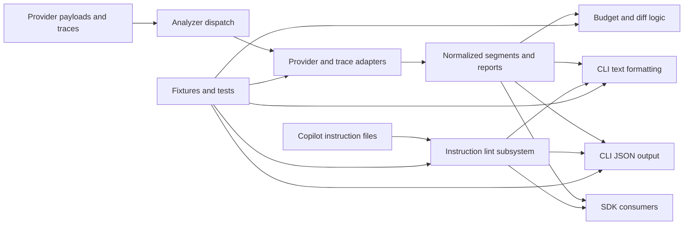

# Orqis Architecture

## Purpose

Orqis is a read-only analysis system for LLM context visibility and Copilot instruction quality.
It ingests heterogeneous payloads and traces, normalizes them into a single internal model for prompt analysis, computes token and budget metadata, and exposes the result through a CLI and SDK. It also includes a dedicated instruction-lint subsystem for GitHub Copilot instruction files.

The architecture should optimize for:

- explicit internal models
- conservative correctness
- adapter extensibility
- deterministic output
- test-bed-first change safety

## System Overview

## Module Boundaries

- `src/cli.ts`
  CLI orchestration only.
  It should parse arguments, load input, call analyzer functions, and print output.
  It should not contain domain logic.

- `src/analyzer.ts`
  Core normalization and analysis layer.
  This is the control plane of the system.
  It dispatches by payload shape, normalizes segments, computes reports, and imports traces.

- `src/types.ts`
  Canonical internal contracts.
  Changes here are architectural, not incidental.

- `src/models.ts`
  Local model registry for context-window and reserved-output defaults.

- `src/tokenizer.ts`
  Conservative token estimation helpers.
  This is heuristic infrastructure, not a source of exact truth.

- `src/instructions/`
  Instruction lint discovery, parsing, scope matching, and rule evaluation for GitHub Copilot instruction files.
  This is a second report family and should not be forced into `ContextReport`.

- `src/format.ts`
  Human-readable rendering only.
  It should not mutate or reinterpret report semantics.

- `src/test/`
  Regression safety net.
  Tests are a first-class part of the architecture because output and adapter behavior are core product surface.

## Core Internal Model

The prompt-analysis architecture is centered on two types:

- `ContextSegment`
- `ContextReport`

`ContextSegment` is the atomic unit of prompt occupancy.
Every adapter should map provider-specific structures into segment types rather than inventing new ad hoc render-time behavior.

`ContextReport` is the normalized result:

- source type
- model and provider
- segments
- total input tokens
- confidence level
- budget summary
- warnings

This makes Orqis similar to a compiler pipeline:

1. parse external representation
2. normalize into internal IR
3. analyze IR
4. render for different consumers

Instruction linting uses a separate report family because the source objects are Markdown files and file-scope relationships, not prompt segments:

- `InstructionFileReport`
- `InstructionLintReport`

## Supported Input Classes

Current architecture supports:

- OpenAI-style message payloads
- OpenAI Responses-style payloads
- Anthropic structured message payloads
- transcript-style offline conversations
- handcrafted `agents[]` snapshots
- OTLP/OpenInference-shaped trace exports
- Langfuse full trace payloads

All of these must converge into the same internal segment/report model.

## Architecture Rules

- Keep the product read-only.
- Keep analyzer semantics in the analyzer layer, never in formatters.
- Prefer adding adapters over branching formatter or CLI behavior by provider.
- Prefer conservative estimates over false precision.
- If a feature needs a new external input shape, add a fixture before expanding logic.
- If the analyzer file becomes difficult to reason about, split adapters into `src/adapters/` but keep the internal model unchanged.

## Stability Boundaries

These are treated as architectural contracts:

- segment taxonomy in `src/types.ts`
- confidence semantics
- `ContextReport` shape
- `DiffReport` shape
- CLI text output guarded by golden tests
- CLI JSON output guarded by integration tests

## Current Architectural Risks

- `src/analyzer.ts` is growing into a large module and will likely need adapter extraction.
- model registry data is still local and static
- token estimation remains heuristic in many paths
- trace import currently supports OpenInference-style exports and Langfuse full trace payloads, but not every ecosystem export variant

## Extension Strategy

New work should usually fit one of these extension points:

- add a new input adapter
- improve normalization fidelity for an existing adapter
- add a new analysis pass on top of `ContextReport`
- add a new instruction-lint rule or scope-matching improvement in `src/instructions/`
- add a new presentation path that consumes existing report objects

Avoid adding provider-specific behavior directly to:

- `src/cli.ts`
- `src/format.ts`
- test-only code paths
